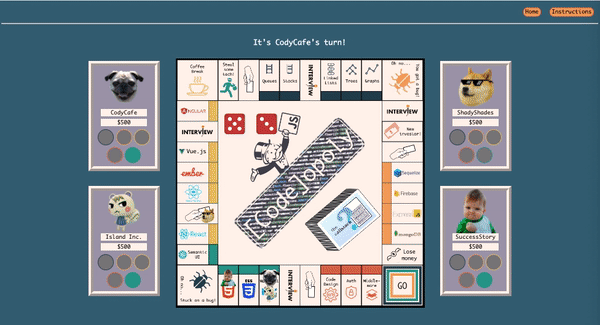

# \[Code]opoly
### Game for developers to sharpen their JavaScript knowledge 

\[Code]opoly is a website board game that two to four players can play and learn about the JavaScript stack. Your goal is to build your tech stack, earn seed money to fund your startup, and reach GO to launch your company! 

### Demo
[YouTube Overview](https://www.youtube.com/watch?v=A4bTjzTkYNY&list=PLx0iOsdUOUmkqg_8ixMky0s59-C2RJnDB&index=11&t=0s)

\[Code]opoly is built on Express.Js with a Firestore database, and has a frontend powered by React, Redux, and Phaser. Socket.io is used to coordinate the player interactions with Phaser, while Firestore handles broadcasting updates of the player scores and game state. Beyond learning this tech stack, our team also researched other frameworks and reviewed JavaScript concepts while writing the game's multiple choice questions. \[Code]opoly is a great way to have fun with friends and reinforce your JavaScript knowledge together.

Team Members: [Kitty Xu](https://github.com/kxu9846), [Venessa Campbell](https://github.com/venessa2020), [Alison Hernandez](https://github.com/alison-hernandez) and [Nora Krantz](https://github.com/norakrantz) 

URL: https://codeopoly.web.app/
